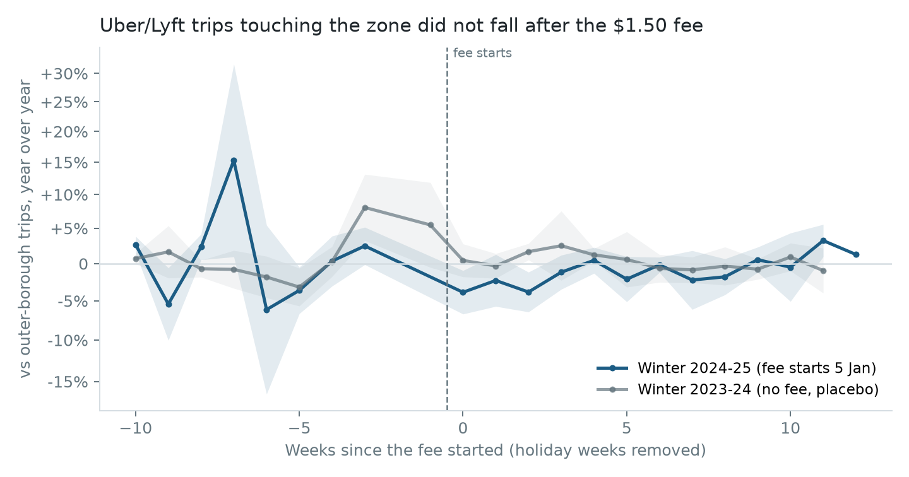
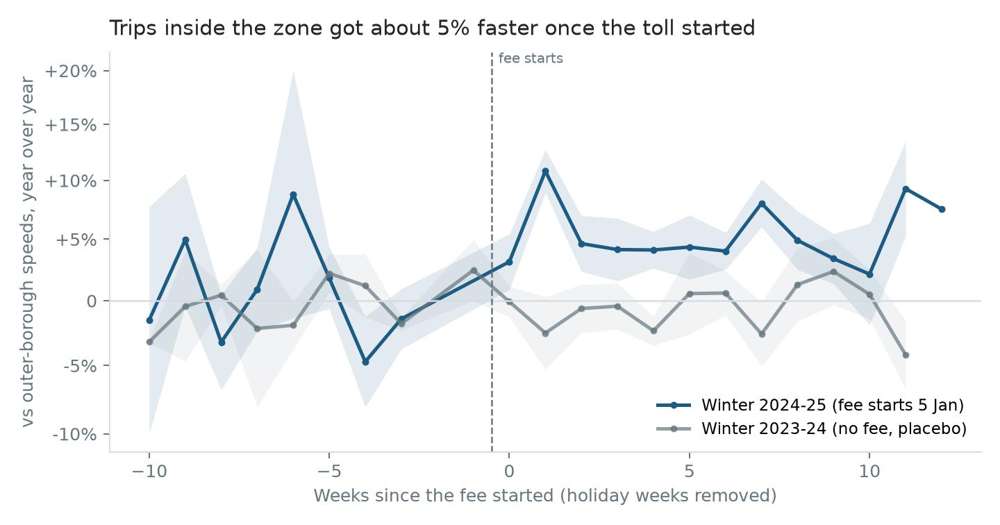
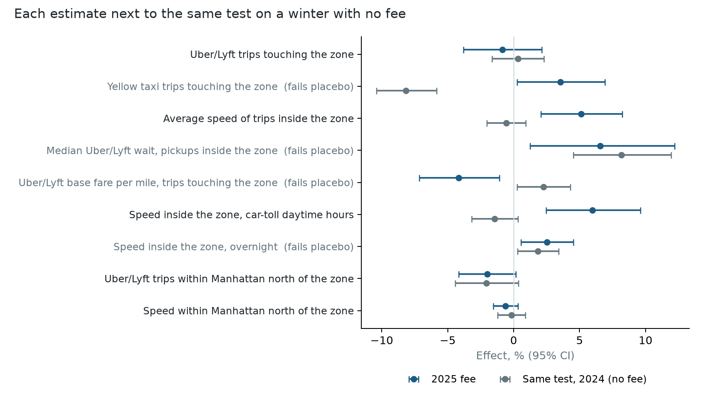

# What did NYC's congestion fee do to taxi and ride-hail trips?

On 5 January 2025, New York started charging a congestion toll south of 60th Street in
Manhattan. Taxi and ride-hail passengers pay it per trip: $0.75 on a yellow taxi, $1.50 on
Uber or Lyft. This project measures what that fee changed, using **344 million trips** from
the city's public trip records, and turns the result into a pricing decision.

## The answer

| Question | Finding | Holds up? |
|---|---|---|
| Did Uber/Lyft trips into or out of the zone fall? | **No measurable change**: −0.9% (95% CI −3.8% to +2.1%) | Yes. Same null against a second control group, for Uber alone, and for February-March alone |
| Did traffic in the zone speed up? | **Yes, +5.1%** (CI +2.1% to +8.2%), **+6.0% in daytime**, when private cars pay the peak toll | Yes. Placebo year shows −0.6%; Holm-adjusted p = 0.004 |
| Did traffic spill into upper Manhattan? | No detectable change in trips (−2.0%) or speed (−0.6%) | Yes |
| Wait times, fares per mile, driver pay, taxi trips, overnight speed | Looked significant at first (four had p < 0.05) | **No.** The same test finds "effects" in a winter with no fee, so these are not reported as findings |

**Decision (for a ride-hail platform):** don't absorb the $1.50 fee. Absorbing it would cost
about **$110M a year**. With demand barely moving, the most it could win back is about
**$27M** in margin, even at the most pessimistic end of the confidence interval, and $6M
at the point estimate. Spend the effort on the speed change instead. Trip-time and ETA
models trained on 2024 traffic will overestimate daytime trips in the zone by about 6%.

The full one-page recommendation is in [MEMO.md](MEMO.md).

## Data

- **NYC TLC trip records**: every yellow-taxi and high-volume for-hire (Uber, Lyft) trip,
  November to March for three winters (2022-23, 2023-24, 2024-25). That is 296M ride-hail
  trips and 48M taxi trips after cleaning (1 minute to 3 hours, 0.1 to 60 miles, under 60 mph).
- **Which zones are inside the toll area comes from the data, not a map.** From 2025 every
  trip records the fee it paid. A trip that starts and ends in the same taxi zone can only pay
  if that zone is inside the toll area. That picks out 40 zones where 99.2% of pickups pay,
  versus at most 42% in the rest of Manhattan. Six zones that straddle 60th Street, where
  about 63% pay, are left out of both groups ([sql/01_crz_zones.sql](sql/01_crz_zones.sql)).
- **The fee landed where it should.** After 5 January, 99.4% of ride-hail trips inside the
  zone paid it, versus 0.1% of outer-borough trips.

All aggregation runs as DuckDB SQL over the raw Parquet files
([sql/02_daily_panel.sql](sql/02_daily_panel.sql)): 344M trips reduced to a 34,170-row
daily panel (by service, company, trip group and daypart) in under 40 seconds.

## Method

Trips got faster from November to March in every year, fee or no fee, so a before/after
comparison would credit the fee with normal seasonal change. Instead, each estimate
differences three times:

1. **Year over year, same weekday.** Each day is compared with the same weekday 52 weeks
   earlier, which removes seasonality and day-of-week patterns.
2. **Treated minus control.** Trips touching the zone minus trips with both ends outside
   Manhattan, which removes citywide shocks such as weather.
3. **After minus before** 5 January 2025.

Holiday windows (Thanksgiving, Christmas to New Year, MLK Day, Presidents' Day) are dropped
whenever they fall on either side of the comparison. That leaves 37 days before the fee and 82 after.

**Inference.** Newey-West standard errors (7-day lags) for serial correlation, checked with a
bootstrap that resamples whole weeks. Holm correction across the five primary outcomes.

**The placebo test.** Every estimate is rerun on the winter before, with a fake start date of
7 January 2024. There was no fee then, so a design that finds an effect there cannot be trusted
for that outcome. This check is what separates the findings from the noise below.

## Results



**Demand did not fall.** Ride-hail trips touching the zone changed by −0.9% relative to
outer-borough trips (CI −3.8% to +2.1%). Against upper-Manhattan trips instead, the change is
+1.2% (CI −2.5% to +5.0%).

Lyft credited riders the $1.50 back throughout January 2025, which could hide a drop. Two checks
rule that out. Uber alone, which gave no credit, shows +0.2% (CI −3.6% to +4.2%). Dropping January
and using only February and March gives −0.1% (CI −3.0% to +2.8%). Over January to March, Lyft's own
trips did no better than Uber's (−3.8%, CI −8.4% to +1.0%, against +0.2%), so there is no sign
the credit won Lyft extra trips.

The fee is 4.3% of the average $34.80 base fare. The point estimate
implies a price elasticity around −0.2, and the confidence interval rules out anything more
elastic than about −0.9. Riders absorbed the fee.



**Traffic in the zone got faster.** Daytime trips inside the zone went from 8.4 to 9.7 mph between
the pre and post windows. They also speed up every winter (8.5 to 9.2 mph over the same weeks a
year earlier), so the fee's share is the extra: **+6.0% in daytime** (CI +2.5% to +9.6%), +5.1%
over the whole day. The weekly estimate is positive in every week after the fee started.
Speeds just north of the zone did not fall (−0.6%, CI −1.5% to +0.3%), so the gain was not
paid for by pushing traffic uptown.



**Five results the placebo test ruled out.** Wait time (+6.6%, p = 0.015), fare per mile (−4.2%,
p = 0.009), taxi trips (+3.5%, p = 0.035) and overnight speed (+2.5%, p = 0.012) all clear the
usual significance bar. All four also show an "effect" in the placebo winter, so their seasonal
pattern differs from year to year and this design cannot separate them from that. Driver pay per
trip was not significant to begin with, and it fails the placebo too. None of these are reported as findings.

**One comparison group was broken, and the raw data showed it.** Measured against outer-borough
taxi trips, taxi trips in the zone "fell 14%". But taxi trips in the zone actually rose 6.5%.
The outer-borough taxi group, only about 5,000 trips a day and airport-heavy, grew 25% over the
same weeks for reasons unrelated to the fee. Taxis are therefore compared with upper-Manhattan
taxi trips, and that comparison fails the placebo test too, so taxi demand is left as inconclusive.

## Should a ride-hail platform absorb the fee?

| | Per year |
|---|---|
| Cost of absorbing $1.50 on every trip touching the zone (about 199,000 trips a day) | **$110M** |
| Margin recovered if absorbing wins back every lost trip, point estimate (about 1,700 trips a day) | $6.0M |
| Same, at the pessimistic end of the confidence interval (about 7,900 trips a day) | $27.2M |

The margin is the base fare minus driver pay, $9.50 a trip, before any other costs. The
calculation assumes, generously, that absorbing the fee wins back every trip it cost. Even so,
absorbing loses $83M to $104M a year.

The fee on yellow-taxi and Uber/Lyft trips alone brought in about $420,000 a day, roughly
$153M a year.

## Limitations

- **Short pre-period.** Holidays leave 37 usable days before the fee, and some are
  Thanksgiving-adjacent travel days; the pre-period in the event-study charts is noisy for that reason.
- **The control group can be affected too.** If riders shifted trips toward the outer boroughs,
  the demand estimate understates the fee's effect. The second control (upper Manhattan) gives
  the same answer, which limits this worry.
- **Speed is trip speed, not road speed.** It covers taxi and ride-hail trips, which follow
  the same streets as other traffic but are not a sensor count.
- **One placebo year.** A single placebo winter can flag a broken design but cannot give a full
  distribution of no-policy estimates. More winters would.
- **Other 2025 changes.** Anything that hit the zone and not the outer boroughs in January
  2025 would be attributed to the fee.

## Reproduce

```bash
DATA_DIR=/path/with/space bash scripts/download.sh    # about 8 GB of TLC Parquet
pip install -r requirements.txt
DATA_DIR=/path/with/space python src/build_panel.py   # SQL: raw trips to daily panel
python src/analyze.py                                 # estimates, charts, business case
pytest -q                                             # estimators recover a planted effect
```

Outputs: [results/estimates.csv](results/estimates.csv) (every estimate, CI, bootstrap CI, p,
Holm p, placebo), [results/business_case.json](results/business_case.json), and
[results/crz_zones.csv](results/crz_zones.csv).
